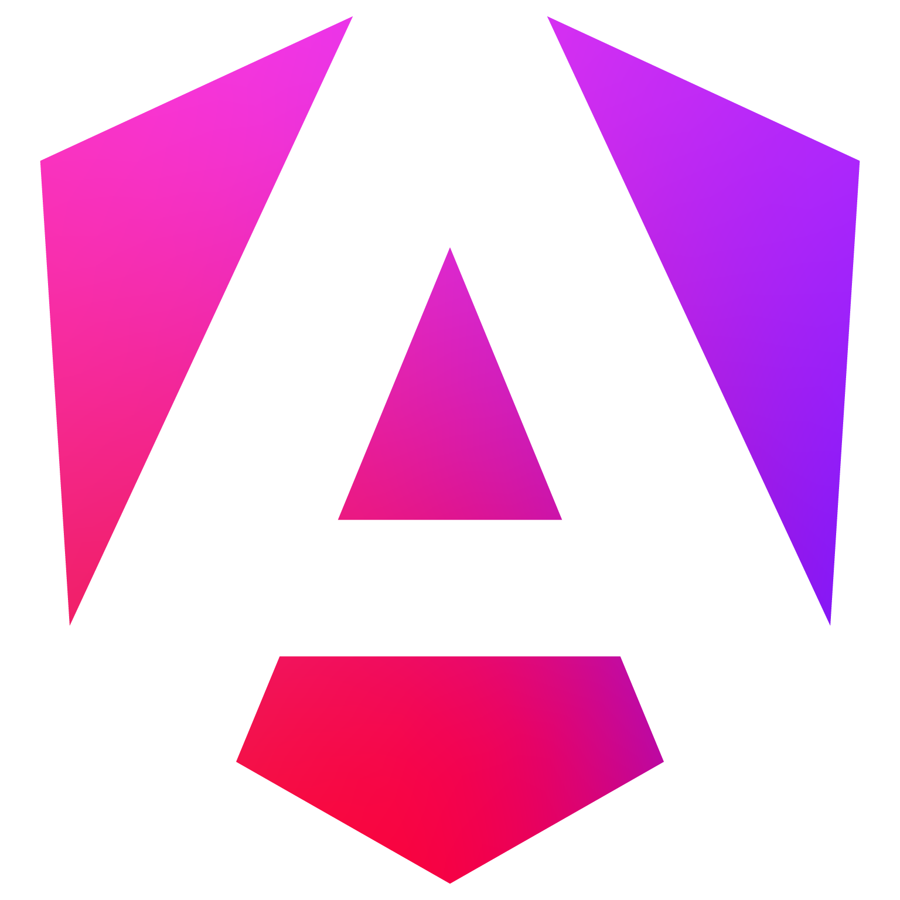

<h1 align="left" id="macropower-title">Hello world !</h1>

<h2 align="left">I'm a french fullstack developer</h2>

- 👨‍💻 &nbsp; I'm currently working at [Millionroads] in [Montpellier], France.
- ❤️ I love nature, sports, my family and the most important... Turn code into product 😂.
- ✨ I'm passionate about the entrepreneurial culture and the digital world.
- 📚 I like reading and tasting good wine too (Nobody's perfect).
- :mailbox: &nbsp; Ask me anything on my **[issues page]**.
- :computer: &nbsp; Keep in touch => **[LinkedIn]**.

<h2 align="left" id="macropower-tech">Favorite Tech 👀</h2>

> Tools, languages, and other things that I like to work with.

<table>
  <tr>
      <td align="center" width="96">
        <a href="#">
          
           Angular
        </a>
      </td>
            <td align="center" width="96">
        <a href="#">
          
           Firebase
        </a>
      </td>
    <td align="center" width="96">
        <a href="#">
          
           NestJS
        </a>
      </td>
          <td align="center" width="96">
        <a href="#">
          
           Git
        </a>
      </td>
                <td align="center" width="96">
        <a href="#">
          
           Sass
        </a>
      </td>
                     <td align="center" width="96">
        <a href="#">
          
           Typescript
        </a>
      </td>
  </tr>
  <tr>
    <td align="center" width="96">
      <a href="#">
        
         Graphql
      </a>
    </td>
                <td align="center" width="96">
      <a href="#">
        
         TailwindCSS
      </a>
    </td>
            <td align="center" width="96">
      <a href="#">
        
         Docker
      </a>
    </td>
        <td align="center" width="96">
      <a href="#">
        
         Rxjs
      </a>
    </td>
    <td align="center" width="96">
      <a href="#">
        
         VueJS
      </a>
    </td>
        <td align="center" width="96">
      <a href="#">
        
         Javascript
      </a>
    </td>
  </tr>
</table>

<h2 align='left'>Some stats 📊</h2>

> “Size matters not. Look at me. Judge me by my size, do you?” - Yoda

  

<!-- links -->
[Millionroads]: https://www.millionroads.com/
[issues page]: https://github.com/timothyalcaide/timothyalcaide/issues "timothyalcaide/issues"
[linkedin]: https://www.linkedin.com/in/timothyalcaide "Timothy Alcaide LinkedIn"
[montpellier]: https://www.google.com/maps/place/Montpellier/@43.6099948,3.8041295,12z "Montpellier"
